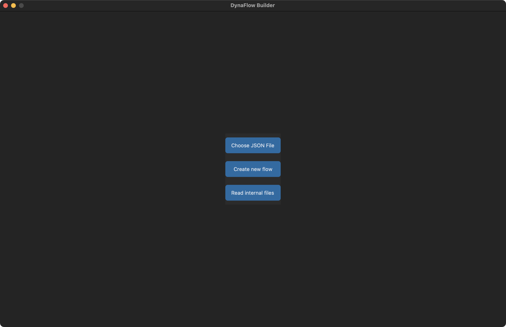
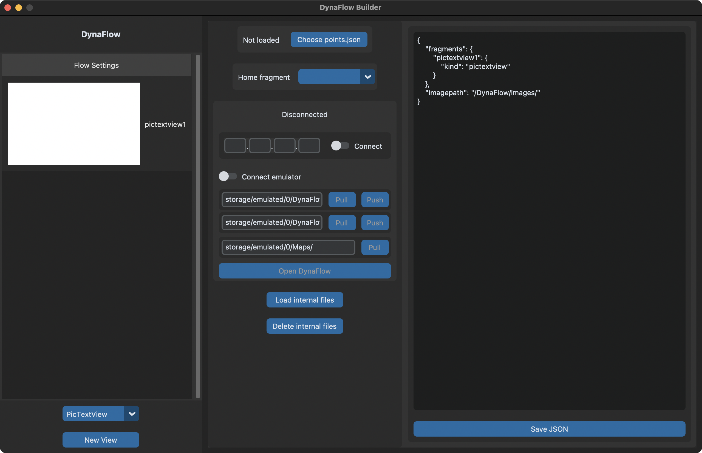

# Usage Guide

# First Menu
When first opening DynaFlow Builder, this screen will appear



You can either:
- Choose JSON file that's saved onto your computer
- Create new flow
    - If you're importing data from Pepper, select this option
- Read internal data
    - Continue from where you've left off

# Flow Settings
Flow settings is where you can pull or push data to Pepper, set home fragment, preview and save flow.json



Setting Home fragment is required to set a starting point of your flow.

If using default `adb_frame`, ensure adb is running by opening a terminal and using `adb devices`

To connect to Pepper:
- Ensure that both computer and Pepper are on the same network
- Check the IP Address of the Tablet via the notification screen on Pepper
- Enter IP address into 4 boxes and click on connect
- Options will now be enabled

To connect to emulator:
- Ensure Android emulator is running on computer
- Click on connect emulator

First entry box contains flow.json location
Second entry box contains images for DynaFlow fragments
Third entry box contains Map points.json for saved locations in map

# Say Tags Settings
When using `Say` for fragments, you can add tags that can modify how Pepper speaks.

This is referenced from [ALTextToSpeech Tutorial](http://doc.aldebaran.com/2-5/naoqi/audio/altexttospeech-tuto.html#tag-tutorial) that also works on Pepper SDK for Android.

### Changing the Speech
Insert `\\vct=value\\` in the text. The value is between 50 and 200 in %. Default value is 100.
```
\\vct=150\\Hello my friends
```

### Changing the speaking rate
Insert `\\rspd=value\\` in the text. The value between 50 and 400 in %. Default value is 100.
```
\\rspd=50\\hello my friends
```

### Inserting a pause
Insert `\\pau=value\\` in the text. The value is a duration in msec.
```
Hello my friends \\pau=1000\\ how are you?
```

### Changing the volume
(May not work for Android)
Insert `\\vol=value\\` in the text. The value is between 0 and 100 in %. Default value is 80. Values > 80 can introduce clipping in the audio signal.
```
\\vol=50\\Hello my friends
```

### Resetting control sequences to the default
Insert `\\rst\\` in the text.
```
\\vct=150\\\\rspd=50\\Hello my friends.\\rst\\ How are you ?
```